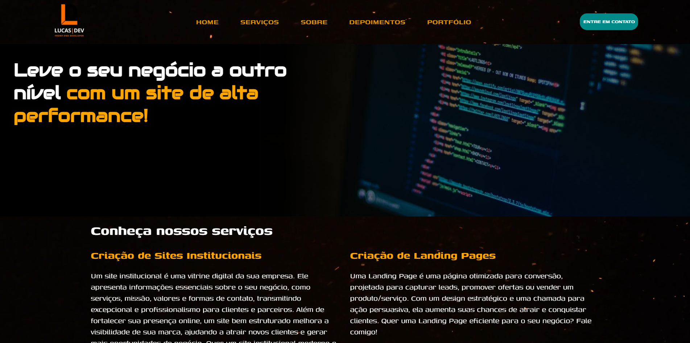
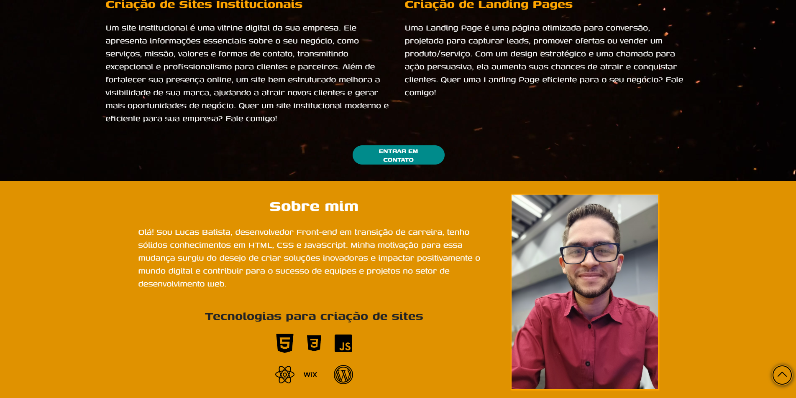
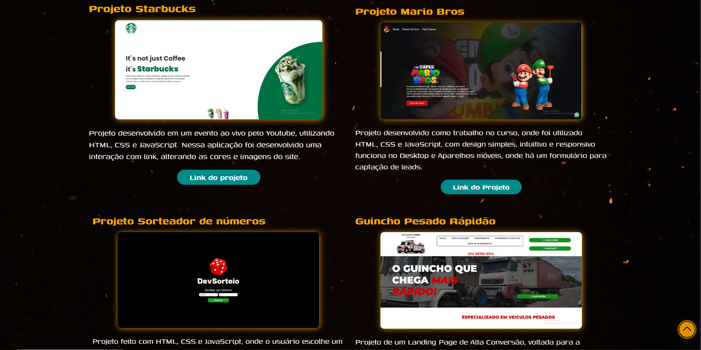
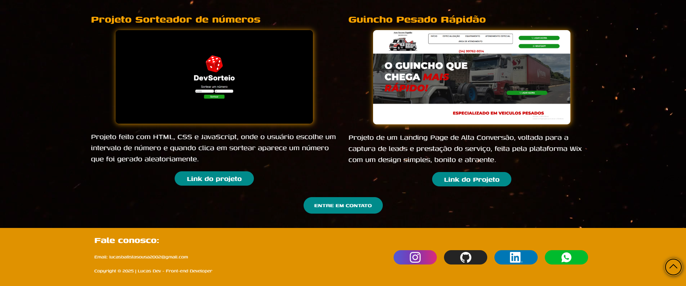

# 💼 Site Pessoal Profissional

Este é um projeto de site pessoal com foco em **captação de clientes**. O layout é moderno, responsivo e pensado para apresentar de forma clara e atrativa meus serviços, projetos anteriores e formas de contato.

## 🧩 Funcionalidades

- **Página inicial impactante** com chamada para ação (CTA)
- **Seção "Sobre mim"** destacando experiência e especialidades
- **Portfólio** com projetos desenvolvidos
- **Depoimentos de clientes**
- **Formulário de contato**
- Totalmente **responsivo** para mobile e desktop

## 💻 Tecnologias Utilizadas

- HTML5
- CSS3
- JavaScript
- Media queries para responsividade

## 📸 Imagens do Site

### 💻 Versão Desktop

  
  
  
  

### 📱 Versão Mobile

  
  

